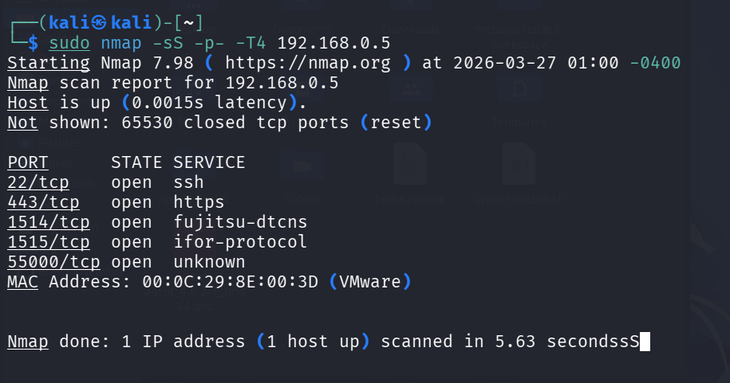
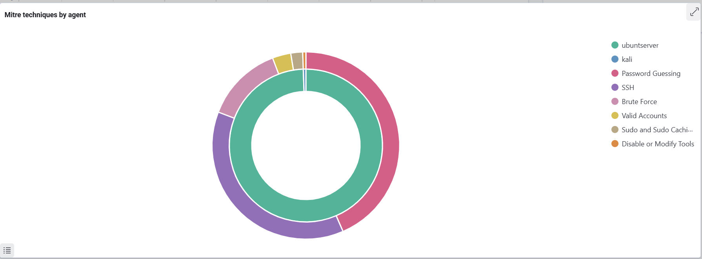
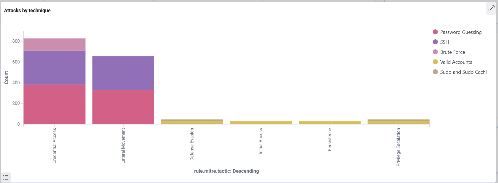
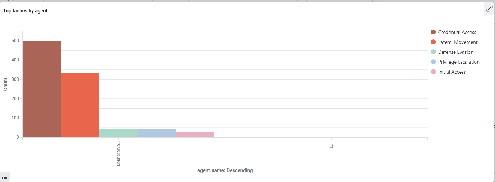

# Wazuh SOC Home Lab

This repository documents a Wazuh-based SOC home lab built by Aheedhul Faaiz, using Ubuntu Server 24.04 LTS as the SIEM backend and Kali Linux as both monitored endpoint and attacker.[file:1] The lab demonstrates SIEM deployment, agent onboarding, SSH brute-force detection, File Integrity Monitoring, and automated Active Response firewall blocking.

## Project Overview

- **SIEM**: Wazuh 4.8.2 all-in-one (manager, indexer, dashboard, Filebeat) on Ubuntu Server 24.04 LTS.
- **Endpoints**: Kali GNU/Linux Rolling 2026.1 (agent + attacker), Windows 11 host as analyst workstation running VMware Workstation 17 Player.[file:1]
- **Attacks simulated**:
  - Nmap SYN scan (documented visibility gap – no alert).
  - Hydra SSH brute-force attack detected and escalated to high-severity brute-force alert.
  - Suspicious payload drop detected via File Integrity Monitoring on `/root/soc_trap`.
  - RDP brute-force against Windows endpoint with account lockout detection.
  - Suspicious PowerShell execution (Base64-encoded commands, discovery chain).
  - Test payload drop with Sysmon Event 11 + Windows Defender integration.[file:1]
- **Response**: Wazuh Active Response configured to automatically firewall-block attacker IPs on brute-force detection.
- **Alert Tuning**: Custom Wazuh rules (100002–100005) suppress investigated false positives using precision PCRE2 matching while preserving detection for real threats.

For a detailed, narrative report of the project, see:

- [`docs/wazuh-project1-report.md`](docs/wazuh-project1-report.md)

### Alert Investigations

SOC-style alert investigation tickets are documented in [`docs/investigations/`](docs/investigations/):

| Ticket | Rule | Severity | Verdict |
|--------|------|----------|---------|
| [SOC-2026-0328-001](docs/investigations/SOC-2026-0328-001.md) | 92213 — Executable file dropped in malware folder | Level 15 | False Positive — Brave browser update |
| [SOC-2026-0328-002](docs/investigations/SOC-2026-0328-002.md) | 92200 — Scripting file in Temp folder | Level 6 | False Positive — Windows svchost diagnostic |

## Architecture

## Key Screenshots

### Wazuh agents (Kali connected)

### Hydra SSH brute-force before Active Response

### Hydra SSH brute-force after Active Response (timeouts)

### File Integrity Monitoring alert for /root/soc_trap

### Nmap SYN scan (visibility gap – no alert)

### MITRE ATT&CK techniques by agent

### Attacks by technique

### Tactics by agent

## Scripts

The `scripts/` directory contains helper scripts used during lab setup:

| Script | Purpose |
|--------|---------|
| `dynamic-ip-helper.py` | Updates the Wazuh agent config with a new manager IP (Python/Linux) |
| `dynamic-ip-helper-win.ps1` | Updates the Wazuh Windows agent config with a new manager IP (PowerShell) |
| `update-wazuh.sh` | Same as dynamic-ip-helper.py (Bash version – kept as a cross-language reference) |
| `enable_fim.py` | Injects FIM real-time monitoring config into `ossec.conf` |
| `inject_active_response.py` | Injects Active Response firewall-drop config into `ossec.conf` |

## Configs

The `configs/` directory contains configuration snippets used in the lab:

| Config | Purpose |
|--------|---------|
| `sysmon-config.xml` | Minimal Sysmon config: Events 1 (Process), 3 (Network), 11 (File), 22 (DNS) with noise filtering |
| `alert-tuning-rules.xml` | Custom Wazuh rules (100002–100005) for false positive suppression |
| `fim-config-snippet.xml` | FIM real-time monitoring config for `/root/soc_trap` |
| `active-response-snippet.xml` | Active Response firewall-drop config on Rule 5763 |