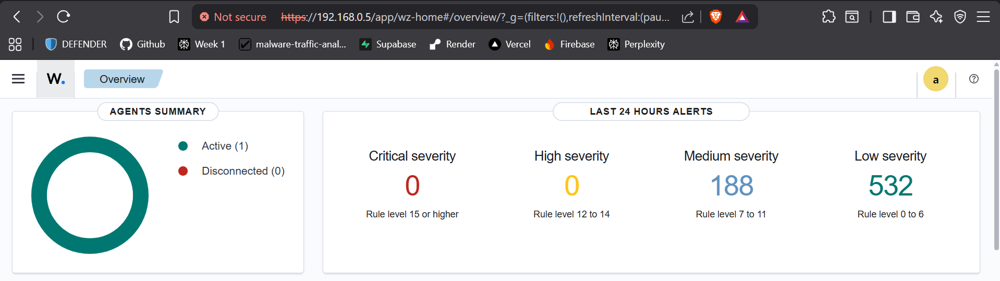
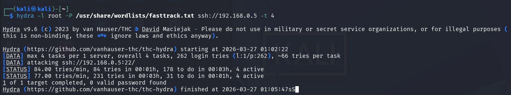
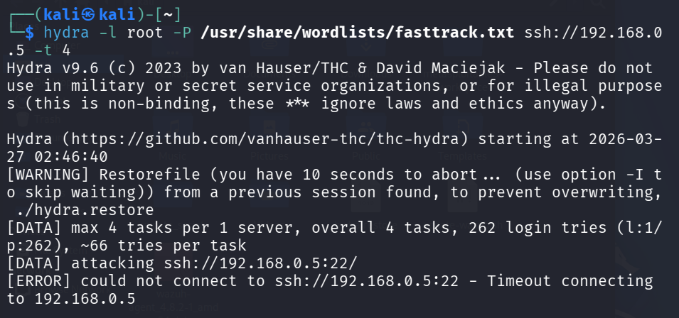
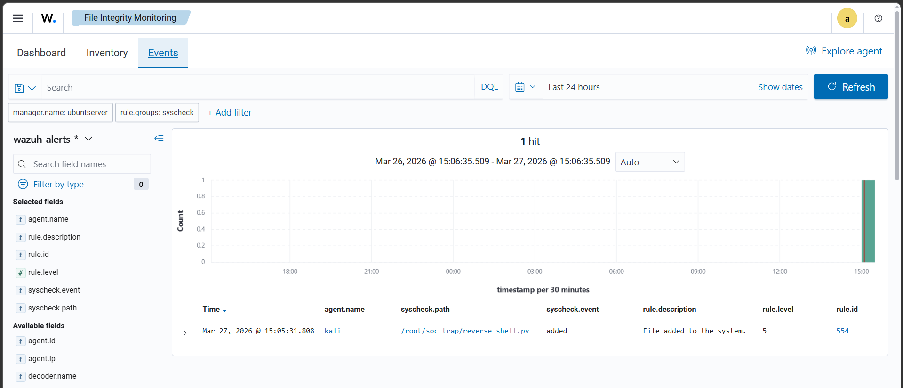

# Wazuh SOC Home Lab

This repository documents a Wazuh-based SOC home lab built by Aheedhul Faaiz, using Ubuntu Server 24.04 LTS as the SIEM backend and Kali Linux as both monitored endpoint and attacker.[file:1] The lab demonstrates SIEM deployment, agent onboarding, SSH brute-force detection, File Integrity Monitoring, and automated Active Response firewall blocking.

## Project Overview

- **SIEM**: Wazuh 4.8.2 all-in-one (manager, indexer, dashboard, Filebeat) on Ubuntu Server 24.04 LTS.
- **Endpoints**: Kali GNU/Linux Rolling 2026.1 (agent + attacker), Windows 11 host as analyst workstation running VMware Workstation 17 Player.[file:1]
- **Attacks simulated**:
  - Nmap SYN scan (documented visibility gap – no alert).
  - Hydra SSH brute-force attack detected and escalated to high-severity brute-force alert.
  - Suspicious payload drop detected via File Integrity Monitoring on `/root/soc_trap`.[file:1]
- **Response**: Wazuh Active Response configured to automatically firewall-block attacker IPs on brute-force detection.

For a detailed, narrative report of the project, see:

- [`docs/wazuh-project1-report.md`](docs/wazuh-project1-report.md)

## Architecture

## Key Screenshots

### Wazuh agents (Kali connected)

### Hydra SSH brute-force before Active Response

### Hydra SSH brute-force after Active Response (timeouts)

### File Integrity Monitoring alert for /root/soc_trap

